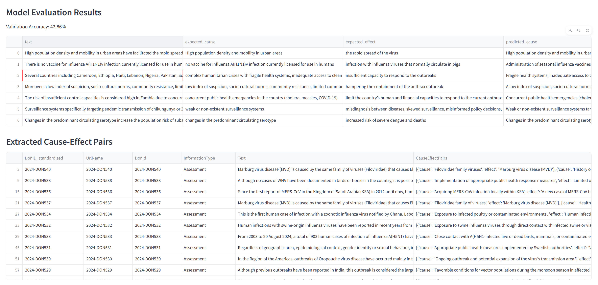

<h1 align='center'>DRIVERS OF PESTS AND PATHOGENS INVESTIGATION</h1>

## Project description

Emerging pests and pathogens (EPPs) are an increasingly disruptive force to human society that can cause large social and ecological changes far beyond their initial site of emergence. Three forces contribute to this growing challenge now and in the foreseeable future: first, potential EPPs are more likely to come in to first contact with human habitats as human land use expands. Second, denser human trade and travel networks mean that EPPs are more likely to emerge in new regions. Third, human technology, such as biocidal agents, increases risks for re-emergence. Understanding how EPPs cascade across scales in social-ecological systems is therefore an urgent priority, but no formal approach currently exists for analysing the ripple effects at scale, from their seeding to their lasting societal imprints. This project aims to fill this gap in sustainability science for society.

Email: peter.sogaard.jorgensen@su.se  

## Table of Contents

Show/Hide

 

- [Project description](#project-description)
- [Table of Contents](#table-of-contents)
- [Code Updates](#code-updates)
  - [2025-03-12](#2025-03-12)
- [File Descriptions](#file-descriptions)
- [Structure of Page's py files:](#structure-of-pages-py-files)
- [Environment setup](#environment-setup)
- [Deployment instruction](#deployment-instruction)

## Code Updates

### 2025-03-12

- The openai/o3-mini model was set as the default LLM model. The reasoning model is believed providing better result.
Additionally, both o1 and o3 models (including their mini variants) are part of the same "reasoning model" family that require specific configuration (temperature=1.0, tokens >= 5000). 
- Create the `env/.env` file to keep your OpenAI API in this format `OPENAI_API_KEY=''`
- Add new packages in `requirements.txt`, you may need to run `uv pip sync requirements.txt` to synchonize the packages
- Create `data/output` subfolder to store model results
- First attempt to run the model, the accuracy was not high. In addition, the Cause-Effect pairs data should be presented in long format.
  

## File Descriptions

Show/Hide

 
    
* <strong>[ Data ](https://github.com/Amareteklay/cause-effect/tree/master/data)</strong>: folder containing all data files
    * <strong>corpus.csv</strong>: Raw data crawled from WHO-DONs website (latest data on 31 Oct 2024). Each article has its own DonID and contains typical information of an outbreak reports including Summary, Overview, Epidemiology, Assessment, Advice and Further Information. Currently, only `Assessment section` is considered for analysis. The file is used to extract drivers of EPPs using large language models
    * <strong>output/extracted_cause_effect.csv</strong>: Result obtained from running the LLM
    * <strong>output/evaluation_results.csv</strong>: Calibrated results to validate the model precision
    * <strong>result_df_31_oct.csv</strong>: Output file from the task `Causality Extraction` above and then be used in the task `Driver Mapping`
    * <strong>drivers.xlsx</strong>: A pre-defined list of relevant drivers of EPPs. The file was aggregated from different reviews by two experienced researchers in the field of health, ecology and sustainability. It is used for the `Mapping extracted drivers by LLMs with domain knowledge` 

* <strong>[ Pages ](https://github.com/Amareteklay/cause-effect/tree/master/pages)</strong>: folder containing all Streamlit pages
    * <strong>3_Causality_Extraction.py</strong>: Define classess and functions to extract drivers of EPP from text, with the help of different LLMs.
    * <strong>4_Mapping.py</strong>: Define classess and functions to map identified drivers from the previous step with a predefined list of drivers.

* <strong>[ App ](https://github.com/Amareteklay/cause-effect/blob/main/app.py)</strong>: Empty file to start the app
* <strong>[ Config file ](https://github.com/Amareteklay/cause-effect/blob/main/config.py)</strong>: For configuring models, APIs
* * <strong>[ Utils file ](https://github.com/Amareteklay/cause-effect/blob/main/utils.py)</strong>: To define universal functions

## Structure of Page's py files:

Show/Hide

 
    
1. Causality Extraction
   * 1.1 Import libraries and data
   * 1.2 Only keep `Assessment` information of the column `InformationType`, and the first 20 rows
   * 1.3 Define class `CauseEffectExtractionSignature`, for ...
   * 1.4 Define class `CauseEffectExtractionModule`, for..., including sub-methods like...
   * 1.5 Initialize the extraction module

2. Drivers Mapping
   * 2.1 Import libraries and data
   * 2.2 Could you continue here as above...

  
   

## Environment setup 
- Install a standalone `uv` package manager. Check this [link](https://docs.astral.sh/uv/getting-started/installation/)
- Check in the folder, navigate the `Terminal` in Vscode and type `uv venv --python 3.13`
- To install packages, type `uv pip sync requirements.txt`. Installing through uv is much faster than conventional pip. It tooks me only 18s to install all packages     

## Deployment instruction
- Activate the venv by running `.venv\Scripts\Activate.ps1`
- Simply type `streamlit run app.py` in your terminal to start the app

